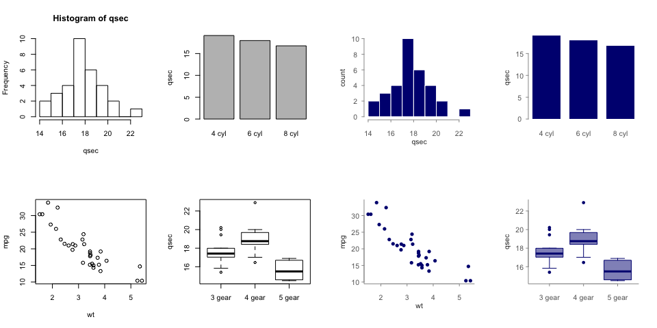
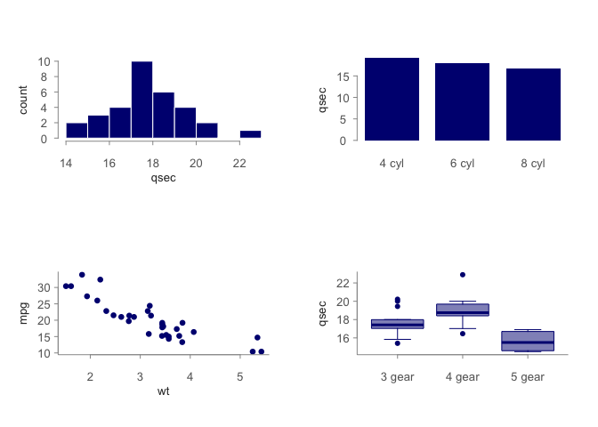
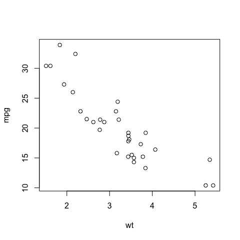
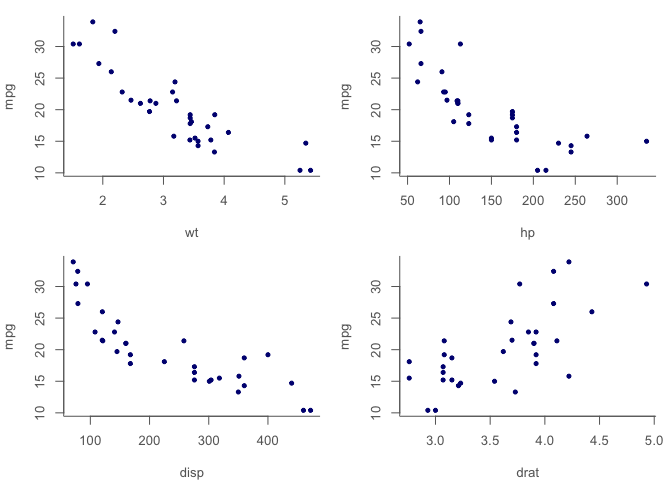

<!-- README.md is generated from README.Rmd. Please edit that file -->
styles
======

The goal of styles is to create and apply themes to base plots.

Installation
------------

You can install styles from github with:

``` r
# install.packages("devtools")
devtools::install_github("ropenscilabs/styles")
```

Examples
--------

Let's compare default plot arguments to a styles:

``` r
library(styles)
library(default)

plot_mat <- matrix(1:8, nrow = 2, byrow = FALSE)
layout(plot_mat)

# plot with plot defaults; without setting a style
example_plots()

# plot with a style
style(better)
example_plots()
```



You can preview internal styles:

``` r
plot_style(better)
```



You can create your own styles:

``` r
blue_stars <- new_style(par = list(pch = 8),
                  graphics = list(plot.xy = list(col = "navyblue")))
style(blue_stars)
plot(mpg ~ wt, data = mtcars)
```



Once we have a style we like, we can apply it to all of our plots:

``` r
blue_dot_grey <- new_style(par = list(pch = 20,
                                      cex=1.2,
                                      bty="l",
                                      col.axis = grey(0.4),
                                      col.lab = grey(0.4),
                                      fg = grey(0.4),
                                      mar=c(4,4,1,1)),
                           graphics = list(plot.xy = list(col = "navyblue")))

style(blue_dot_grey)

plot_mat <- matrix(1:4, nrow = 2, byrow = FALSE)
layout(plot_mat)
plot(mpg ~ wt, data = mtcars)
plot(mpg ~ disp, data = mtcars)
plot(mpg ~ hp, data = mtcars)
plot(mpg ~ drat, data = mtcars)
```


