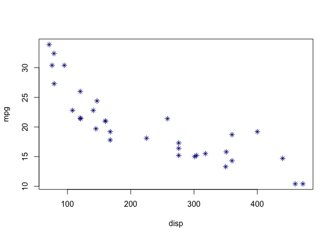
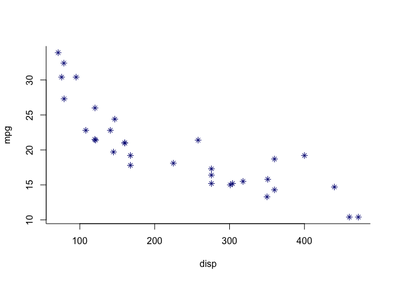

<!-- README.md is generated from README.Rmd. Please edit that file -->
styles
======

The goal of styles is to create and apply ggplot-style themes to base plots.

Installation
------------

You can install styles from github with:

``` r
# install.packages("devtools")
devtools::install_github("lizhmartin/styles")
```

Example
-------

This is a basic example which shows you how to solve a common problem:

``` r
library(styles)

# plot with internal style
plot_mat <- matrix(1:8, nrow = 2, byrow = FALSE)
layout(plot_mat)

example_plots()

style(better)
example_plots()
```


``` r

remove_style()
par(mfrow=c(1,1))

# create a new style:
blue <- new_style(graphics = list(plot.xy = list(col = "navyblue")))
style(blue)
plot(mpg ~ wt, data = mtcars)
```


``` r
remove_style()

blue_stars <- new_style(par = list(pch = 8),
                  graphics = list(plot.xy = list(col = "navyblue")))
style(blue_stars)
plot(mpg ~ wt, data = mtcars)
```


``` r
plot(mpg ~ disp, data = mtcars)
```



``` r
remove_style()

blue_stars_lbox <- new_style(par = list(pch = 8,
                                        bty="l"),
                             graphics = list(plot.xy = list(col = "navyblue")))
style(blue_stars_lbox)
plot(mpg ~ wt, data = mtcars)
```


``` r
plot(mpg ~ disp, data = mtcars)
```



``` r
remove_style()
###
```
